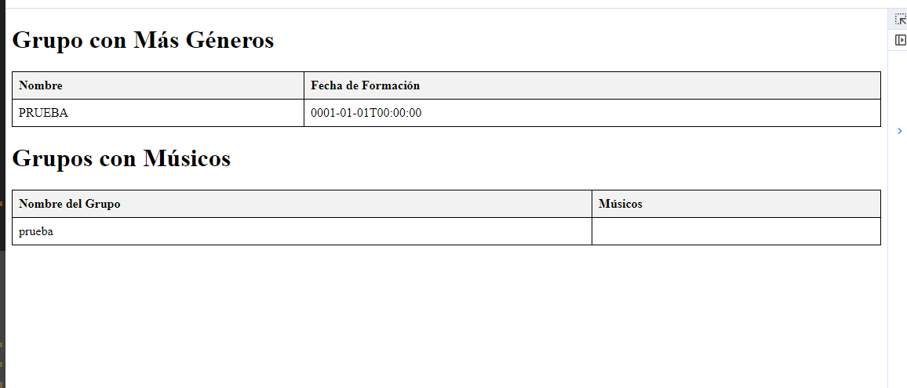
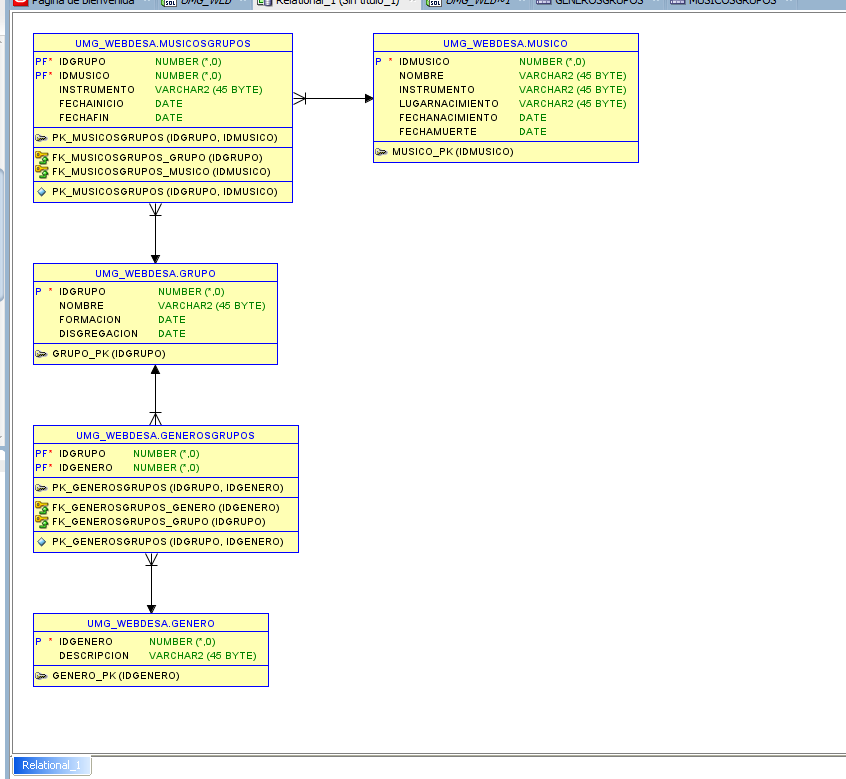
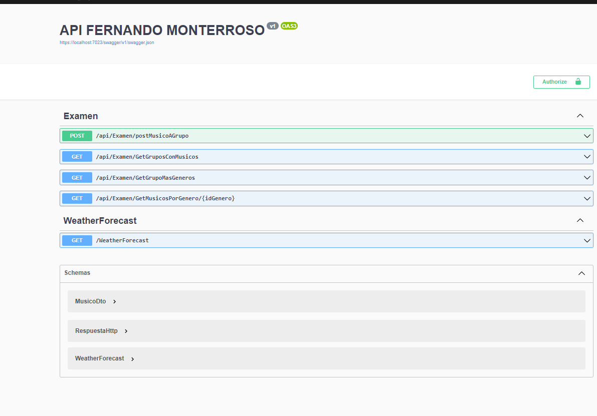

# ExamenWebFinal

Aquí se muestra la captura de pantalla de la demostración de los consumos de servicios web realizados a través de la interfaz de usuario que utiliza Vue.js para realizar peticiones GET y presentar los datos en tablas.

Esta imagen representa el diagrama de la base de datos utilizada en la aplicación, mostrando la estructura y las relaciones entre las tablas de géneros, grupos, músicos y las tablas de asociación correspondientes.

La siguiente imagen es de la interfaz de Swagger UI que documenta y permite la interacción con la API web del proyecto. Swagger proporciona una forma clara y legible de visualizar todos los endpoints disponibles y los métodos HTTP soportados.

